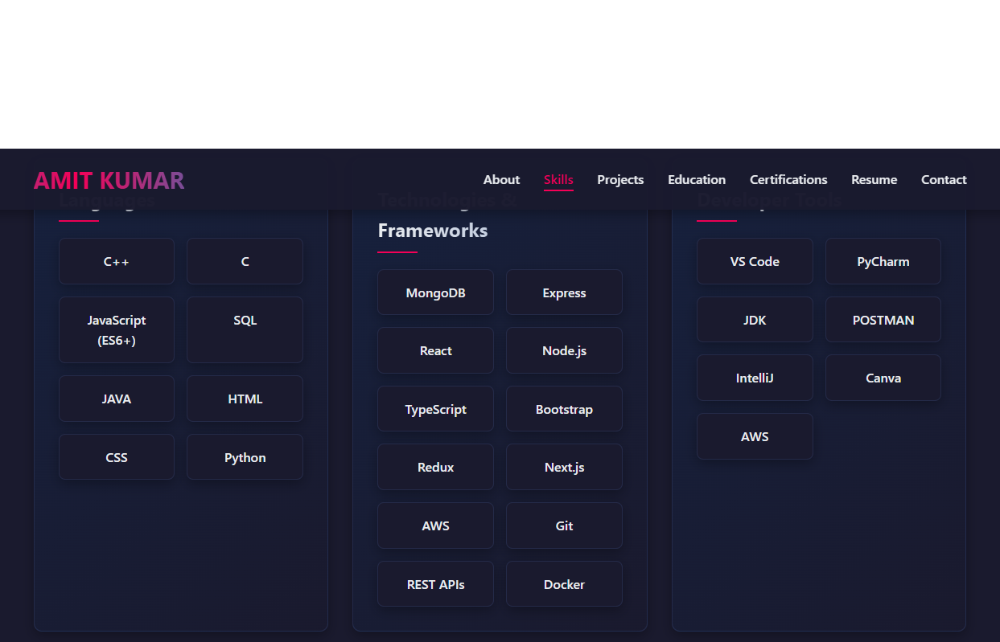
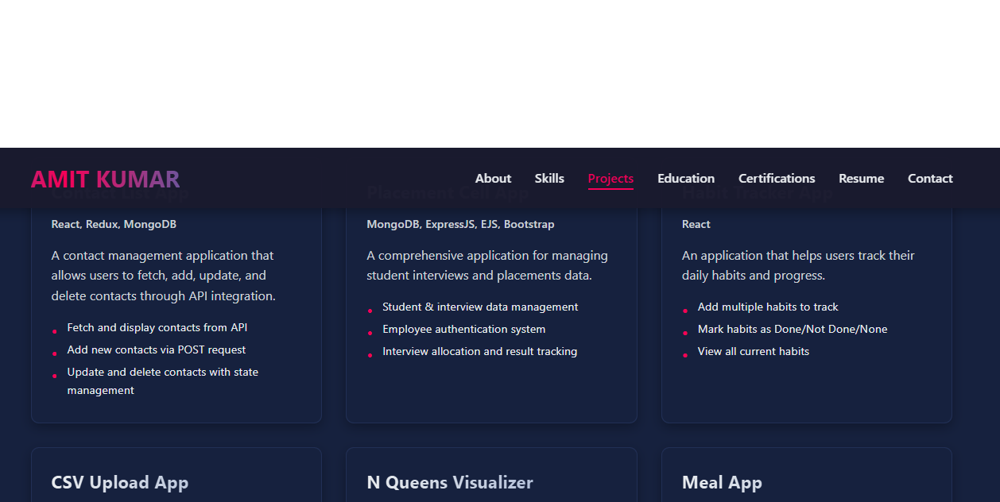
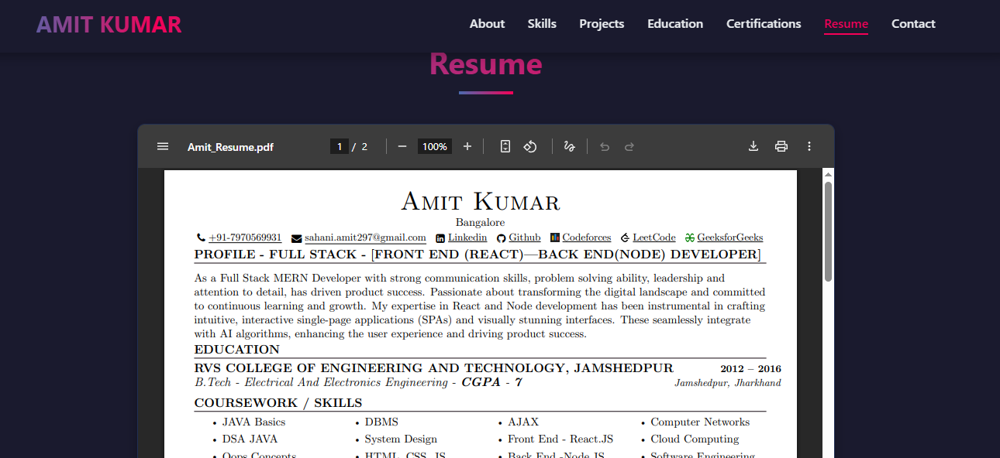
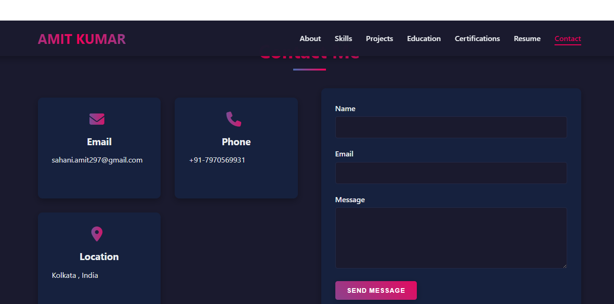

# Amit Kumar - Portfolio Website : - https://portfolio-amit297-1.onrender.com/

A modern, responsive portfolio website showcasing my skills, projects, and experience in Data Science and Web Development.

## Features

- Responsive design that works on all devices
- Dark theme with RGB color transitions and gradient effects
- Interactive UI with hover animations
- Infinite scrolling between sections
- Resume download functionality
- Project showcase with detailed descriptions
- Skills categorization by domain
- Contact form and social media links

## Technologies Used

- HTML5
- CSS3 (with animations and transitions)
- JavaScript (vanilla)
- Responsive design principles
- Git version control

## Screenshots








## Sections

- **Home**: Introduction and brief overview
- **About**: Personal information and background
- **Skills**: Technical skills categorized by domain
- **Projects**: Showcase of completed projects with descriptions
- **Education**: Academic background and certifications
- **Resume**: Resume preview and download option
- **Contact**: Contact form and social media links

## Setup and Installation

1. Clone the repository:
   ```
   git clone https://github.com/Amitsahani287/portfolio.git
   ```

2. Navigate to the project directory:
   ```
   cd portfolio
   ```

3. Open `index.html` in your browser or use a local development server.

## Contact

- **Email**: sahani.amit297@gmail.com
- **GitHub**: [Amitsahani287](https://github.com/Amitsahani287)

## License

This project is open source and available under the [MIT License](LICENSE).

## Contact Form Setup

There are two options for handling the contact form submissions:

### Option 1: PHP Backend (Recommended if you have a PHP server)

The default implementation uses a PHP script (`sendmail.php`) to handle form submissions. This requires a server with PHP support.

1. Make sure your server supports PHP
2. Upload all files to your server
3. The contact form will automatically send emails to sahani.amit502@gmail.com when submitted

### Option 2: Formspree (No server required)

If you don't have a PHP server, you can use Formspree:

1. In index.html, replace the script.js reference with contact-formspree.js:
   ```html
   <!-- Replace this line -->
   <script src="script.js"></script>
   
   <!-- With this line -->
   <script src="contact-formspree.js"></script>
   ```
2. Create a free account at [Formspree](https://formspree.io/)
3. Verify your email address
4. Update the form action in contact-formspree.js with your Formspree endpoint 
